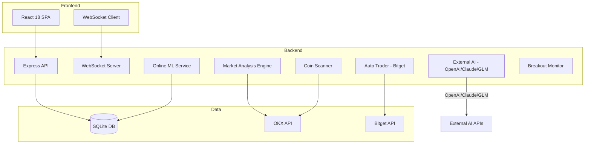
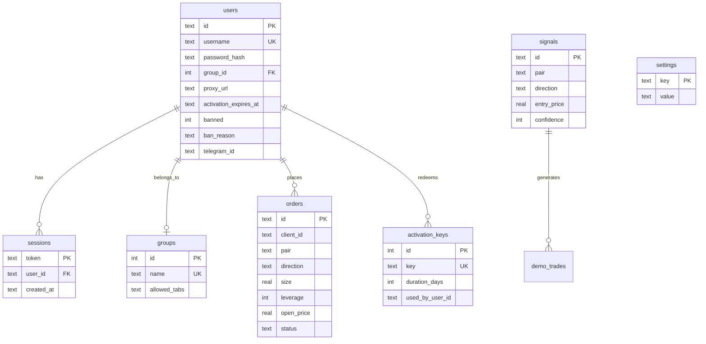

# CLABX — Full Project Analysis & Improvement Plan

## 1. Project Overview

**CLABX** (CryptoSignal Pro) is a crypto trading platform with:
- **Backend**: Node.js + Express + TypeScript + SQLite (better-sqlite3)
- **Frontend**: React 18 + TypeScript + Vite + TailwindCSS + Lightweight Charts
- **Electron**: Desktop app wrapper
- **Exchanges**: OKX (market data), Bitget (auto-trading execution)
- **AI**: Internal online ML + External AI (OpenAI / Claude / GLM)

---

## 2. Architecture Analysis

### 2.1 Strengths
- **Modular service layer**: Services are well-separated (autoTrader, marketAnalysis, signalGenerator, etc.)
- **Graceful degradation**: In-memory fallback when SQLite native module fails (Electron compatibility)
- **Rate limiting**: Custom in-memory rate limiter with bounded store and periodic cleanup
- **Encryption**: AES-256-GCM for API keys stored in DB
- **WebSocket auth**: Token-based authentication with timeout
- **Lazy loading**: Frontend uses `React.lazy()` for all pages except Dashboard/SignalFeed
- **Zod validation**: Schema validation on backend routes

### 2.2 Critical Issues

#### Security
1. **Global broadcast functions on `global`** — [`websocket.ts`](backend/src/websocket.ts:107) stores `broadcastSignal` and `broadcastBreakout` on `(global as any)`. This is fragile and pollutes the global namespace.
2. **No session expiration** — Sessions in [`schema.sql`](backend/src/db/schema.sql:111) have `created_at` but no `expires_at`. Sessions live forever until manually deleted.
3. **CORS wide open** — [`index.ts`](backend/src/index.ts:68) uses `app.use(cors())` with no origin restrictions. In production this should be locked down.
4. **Encryption fallback is Base64** — [`encrypt.ts`](backend/src/lib/encrypt.ts:23) falls back to `b64:` prefix (plain Base64) when `ENCRYPTION_KEY` is not set. This is not encryption, just encoding.
5. **Admin password in .env** — Single shared `ADMIN_PASSWORD` is a weak auth model. Already partially mitigated by DB-based admin users.
6. **No CSRF protection** — Bearer tokens mitigate this somewhat, but the admin panel stores tokens in localStorage which is XSS-vulnerable.

#### Performance
7. **Massive route files** — [`market.ts`](backend/src/routes/market.ts) is 72KB, [`admin.ts`](backend/src/routes/admin.ts) is 48KB, [`AutoTradingPage.tsx`](frontend/src/pages/AutoTradingPage.tsx) is 91KB. These are extremely hard to maintain.
8. **No database connection pooling** — Single SQLite connection with WAL mode. Fine for moderate load but will bottleneck under concurrent writes.
9. **In-memory rate limiter** — Won't work across multiple instances. Comment in [`rateLimit.ts`](backend/src/middleware/rateLimit.ts:4) acknowledges this.
10. **No caching layer** — Market data fetched directly from OKX on every request. Only [`TtlCache`](backend/src/lib/ttlCache.ts) exists but usage is limited.

#### Code Quality
11. **`db` typed as `any`** — [`index.ts`](backend/src/db/index.ts:16) declares `let db: any = null`. Loses all type safety for database operations.
12. **No router-level error handling** — Routes don't consistently use [`asyncHandler`](backend/src/middleware/errorHandler.ts:36). Unhandled promise rejections in routes will crash or hang.
13. **Frontend App.tsx is monolithic** — [`App.tsx`](frontend/src/App.tsx) at 37KB handles routing, navigation, tab permissions, and layout all in one file.
14. **No proper router** — Custom URL-based navigation instead of React Router. Manual `pushState`/`popstate` handling.
15. **Duplicate type definitions** — Signal types defined in both backend and frontend without shared package.
16. **No test coverage** — Only 3 test files exist: [`semaphore.test.ts`](backend/src/lib/semaphore.test.ts), [`ttlCache.test.ts`](backend/src/lib/ttlCache.test.ts), [`marketAnalysis.test.ts`](backend/src/services/marketAnalysis.test.ts).

#### Architecture
17. **Business logic in routes** — [`market.ts`](backend/src/routes/market.ts) contains auto-trading state management, analysis orchestration, and order execution logic mixed with HTTP handlers.
18. **No dependency injection** — Services import each other directly, making testing and mocking difficult.
19. **No migration system** — Schema changes are handled by inline `ALTER TABLE` statements scattered across [`authDb.ts`](backend/src/db/authDb.ts) and [`index.ts`](backend/src/db/index.ts).
20. **Telegram bot referenced but missing** — `package.json` has `build:bot` and `start:bot` scripts referencing `telegram-bot/` directory which doesn't exist in the workspace.

---

## 3. Improvement Recommendations

### Priority 1: Security Hardening
- Add session expiration (TTL-based, e.g. 7 days)
- Configure CORS with specific allowed origins
- Make `ENCRYPTION_KEY` required in production (fail-start if missing)
- Add CSRF tokens or move to httpOnly cookies
- Remove global broadcast pattern; use EventEmitter or singleton

### Priority 2: Code Organization & Maintainability
- Split [`market.ts`](backend/src/routes/market.ts) into separate route + service files
- Split [`admin.ts`](backend/src/routes/admin.ts) into sub-routers (users, keys, settings, etc.)
- Split [`AutoTradingPage.tsx`](frontend/src/pages/AutoTradingPage.tsx) into smaller components
- Extract auto-trading state management into a dedicated service
- Introduce React Router for proper client-side routing
- Create shared types package or at least a shared types directory

### Priority 3: Reliability & Testing
- Add `asyncHandler` wrapper to all async route handlers
- Implement proper DB migration system (e.g. numbered SQL files)
- Add comprehensive test suite (unit tests for services, integration tests for routes)
- Add health check for external dependencies (OKX, Bitget connectivity)
- Type the database layer properly (remove `any` types)

### Priority 4: Performance & Scalability
- Add Redis-backed caching for market data (or expand TtlCache usage)
- Implement request deduplication for concurrent identical market data requests
- Add database indexes for common query patterns
- Consider connection pooling or read replicas if scaling beyond single instance
- Add response compression (gzip/brotli middleware)

### Priority 5: Developer Experience
- Add ESLint + Prettier configuration
- Add pre-commit hooks (husky + lint-staged)
- Add CI/CD pipeline configuration
- Add API documentation (OpenAPI/Swagger)
- Add environment validation on startup (fail fast on missing required vars)

---

## 4. File Size Analysis (Largest Files — Refactoring Candidates)

| File | Size | Issue |
|------|------|-------|
| [`AutoTradingPage.tsx`](frontend/src/pages/AutoTradingPage.tsx) | 91KB | Monolithic page component |
| [`market.ts`](backend/src/routes/market.ts) | 72KB | Route + business logic mixed |
| [`TradePage.tsx`](frontend/src/pages/TradePage.tsx) | 65KB | Large trading UI |
| [`admin.ts`](backend/src/routes/admin.ts) | 48KB | All admin endpoints in one file |
| [`SettingsPage.tsx`](frontend/src/pages/SettingsPage.tsx) | 44KB | Many settings sections |
| [`authDb.ts`](backend/src/db/authDb.ts) | 38KB | All user/auth DB operations |
| [`App.tsx`](frontend/src/App.tsx) | 37KB | Routing + layout + permissions |
| [`marketAnalysis.ts`](backend/src/services/marketAnalysis.ts) | 36KB | Analysis engine |
| [`autoTrader.ts`](backend/src/services/autoTrader.ts) | 34KB | Trading execution |
| [`DemoPage.tsx`](frontend/src/pages/DemoPage.tsx) | 34KB | Demo trading page |
| [`ChartView.tsx`](frontend/src/pages/ChartView.tsx) | 34KB | Chart component |

---

## 5. Dependency Analysis

### Backend Dependencies
- **ccxt ^4.2.0** — Exchange connectivity (OKX + Bitget)
- **better-sqlite3 ^12.6.2** — SQLite with native bindings
- **bcrypt ^6.0.0** — Password hashing
- **ethers ^6.16.0** — Ethereum/wallet operations
- **tronweb ^6.2.0** — TRON blockchain
- **technicalindicators ^3.1.0** — TA library
- **zod ^4.3.6** — Schema validation
- **undici ^6.23.0** — HTTP client (for AI API calls with proxy)

### Frontend Dependencies
- **react ^18.2.0** — UI framework
- **lightweight-charts ^4.1.0** — TradingView charts
- **zustand ^4.4.0** — State management (minimal usage observed)
- **axios ^1.6.0** — HTTP client

### Observations
- **No React Router** — Custom routing implementation
- **Zustand underutilized** — Most state is in component-level useState or context
- **No form library** — Manual form handling throughout
- **No i18n** — UI is hardcoded in Russian

---

## 6. Database Schema Review

### Schema Issues
- **No foreign key enforcement** — SQLite FK enforcement not enabled (`PRAGMA foreign_keys = ON` missing)
- **Sessions have no expiry** — No `expires_at` column
- **`allowed_tabs` stored as JSON string** — Not normalized, parsed on every read
- **`orders.client_id`** — Not a foreign key to users; appears to be a separate client identifier
- **No audit trail** — No `updated_at` on users, no action log table

---

## 7. Actionable TODO List

See the todo list tracked via the task management system for step-by-step implementation items.
