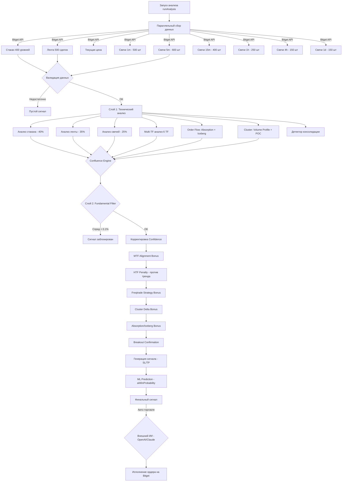
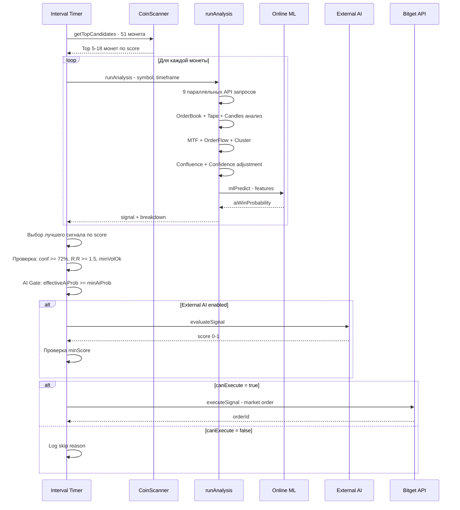

# CLABX — Глубокий анализ системы рыночной аналитики

## 1. Общая архитектура анализа



## 2. Последовательность анализа

### Этап 1: Сбор данных (DataAggregator)
- **Источник**: Bitget REST API через CCXT
- **Параллельный запрос** 9 потоков данных одновременно
- **Retry**: 2 попытки с переключением прокси при таймауте
- **Данные**: Стакан 400 уровней, 500 сделок, свечи 6 таймфреймов

### Этап 2: Валидация данных
- Минимум 5 уровней в стакане (bid + ask)
- Минимум 5 сделок в ленте
- Минимум 50 свечей на 5m
- При недостатке — возврат пустого сигнала

### Этап 3: Технический анализ (3 компонента)

#### 3.1 Анализ стакана (40% веса) — `analyzeOrderBook()`
| Метрика | Описание | Пороги |
|---------|----------|--------|
| DOM Score | (Bid_1% - Ask_1%) / Total | >0.3 Bull, <-0.3 Bear |
| Imbalance | (TotalBid - TotalAsk) / Total | >0.3 = +2, >0.2 = +1 |
| Zone Analysis | 5 зон: 0.05%, 0.1%, 0.2%, 0.5%, 1% | Дисбаланс >0.3 в зоне |
| Pressure | SUM(Qty * e^(-distance*100)) | BuyPct >60% = +2 |
| Wall Detection | Qty > AvgQty * 3 | Bid walls > Ask walls = +2 |
| Spread Squeeze | Спред < 0.05% + DOM bias | +1 при направленном DOM |

**Итого**: до ~15 баллов, направление при перевесе >1.3x и confidence >25%

#### 3.2 Анализ ленты (35% веса) — `analyzeTape()`
| Метрика | Описание | Пороги |
|---------|----------|--------|
| Volume Delta | (Buy - Sell) / Total | >20% = +3, >10% = +2 |
| Weighted Delta | По размеру: Small x1, Medium x2, Large x5, Whale x10 | >25% = +2 |
| CVD Divergence | Цена vs CVD расхождение | Сильнейший сигнал |
| Recent Delta | Дельта последних 50% сделок | Приоритет «настоящего» |
| Aggression | Агрессивные покупки/продажи | Дополнительный вес |
| Multi-window | 4 окна: 1m, 5m, 15m, 1h с весами | Взвешенное направление |

#### 3.3 Анализ свечей (25% веса) — Multi-TF через `CandleAnalyzer`
| Индикатор | Описание |
|-----------|----------|
| RSI (14) | Перекупленность/перепроданность |
| MACD | Пересечения, гистограмма |
| Bollinger Bands | Squeeze, ширина, позиция цены |
| EMA 21/50 | Тренд, пересечения |
| ATR | Волатильность, размер стопа |
| ADX | Сила тренда (>25 = тренд) |
| Supertrend | Направление тренда |
| Market Structure | Higher Highs/Lows vs Lower Highs/Lows |

**Свечные паттерны**:
- Engulfing (бычье/медвежье поглощение)
- Hammer / Inverted Hammer
- Shooting Star / Hanging Man
- Doji / Dragonfly / Gravestone
- Three White Soldiers / Three Black Crows
- Morning Star / Evening Star

**Freqtrade стратегии**:
- BinHV45 Lower BB Reversal
- ClucMay72018 Low Volume Dip
- HLHB EMA/RSI Cross
- Volatility Breakout
- EMARSI Oversold
- RSI Divergence (бычья/медвежья)

### Этап 4: Multi-Timeframe анализ
- **6 таймфреймов**: 1d, 4h, 1h, 15m, 5m, 1m
- **Веса**: 1d и 4h имеют наибольший вес
- **Alignment**: Количество TF в одном направлении
- **HTF Override**: EMA 21/50 на 1h/4h/1d определяет тренд

### Этап 5: Order Flow анализ
- **Absorption**: Крупный игрок поглощает ордера на уровне
- **Iceberg**: Скрытые крупные ордера (повторяющиеся сделки одного размера)
- **Volume Profile**: POC, HVN/LVN зоны
- **Consolidation**: Детектор бокового движения

### Этап 6: Confluence Engine — `computeSignal()`
- Минимум 2 из 3 компонентов должны совпадать по направлению
- Confidence >= 60%
- R:R >= 1.5
- Spread < 0.1%
- Адаптивные веса по режиму торговли (scalping/standard/breakout)

### Этап 7: Корректировка Confidence
| Фактор | Бонус/Штраф |
|--------|-------------|
| MTF 5+ TF aligned | +10% (max 96%) |
| MTF 4 TF aligned | +6% (max 95%) |
| MTF 3 TF aligned | +2% (max 90%) |
| MTF < 3 aligned | -8% (min 55%) |
| Against HTF trend | -15% (max 70%) |
| HLHB match | +4% |
| Volatility Breakout match | +3% |
| Supertrend match | +2% |
| ADX > 30 | +2% |
| Cluster delta align | +3% |
| Absorption detected | +5% |
| Iceberg detected | +4% |
| Breakout mode: 2/3 confirmations | +5% |
| Breakout mode: < 2 confirmations | -8% |

### Этап 8: Генерация сигнала — `SignalGenerator`
- **SL**: min(ATR * 1.35, Entry * 0.55%) — ужесточён для R:R
- **TP1**: Entry ± Risk * 2.0 (30% позиции)
- **TP2**: Entry ± Risk * 3.2 (40% позиции)
- **TP3**: Entry ± Risk * 4.5 (30% позиции)
- **Min TP distance**: 0.2% от входа (покрытие комиссии)
- **Trailing Stop**: Активация после TP1 или +1% прибыли

### Этап 9: ML Prediction
- Онлайн-модель обучается на закрытых ордерах
- Фичи: confidence, direction, R:R, triggers count, RSI bucket, volume confirm, ATR norm, spread norm
- Выход: aiWinProbability (0-1)
- Корректировка confidence на основе ML

### Этап 10: Внешний ИИ (опционально, только в авто-торговле)
- OpenAI / Claude / GLM
- Оценка сигнала с контекстом рынка
- Может блокировать ордер при низкой оценке

## 3. Оценка качества анализа

### Сильные стороны
1. **Многослойный анализ** — 3 независимых компонента + confluence
2. **Multi-TF** — 6 таймфреймов с весами, HTF override
3. **Order Flow** — absorption, iceberg, volume profile
4. **Адаптивные режимы** — scalping/standard/breakout с разными весами
5. **Freqtrade стратегии** — проверенные алгоритмические стратегии
6. **ML + External AI** — двойная AI-фильтрация
7. **Risk Management** — Schwager/Burniske принципы (R:R >= 2, 2% риска)

### Слабые стороны и рекомендации

#### Проблема 1: Слишком много бонусов confidence
Каждый фактор добавляет бонус, но нет общего лимита на суммарный бонус. Confidence может достигать 96% что создаёт ложную уверенность.

**Рекомендация**: Ввести максимальный суммарный бонус (например +20% от базового confidence).

#### Проблема 2: Нет учёта ликвидности при определении размера позиции
Open Interest и глубина стакана не влияют на размер позиции.

**Рекомендация**: Добавить проверку Open Interest и глубины стакана для определения максимального размера позиции.

#### Проблема 3: Фундаментальный фильтр слишком простой
Только проверка спреда. Нет учёта новостей, funding rate, open interest dynamics.

**Рекомендация**: Расширить FundamentalFilter: funding rate bias, OI changes, news sentiment.

#### Проблема 4: Нет учёта корреляции с BTC
Альткоины сильно коррелируют с BTC. Сигнал на альткоин без учёта BTC тренда ненадёжен.

**Рекомендация**: Добавить BTC correlation check — если BTC падает, LONG на альткоинах рискован.

#### Проблема 5: Нет учёта времени суток
Волатильность и ликвидность зависят от сессии (Азия/Европа/Америка).

**Рекомендация**: Добавить session-aware фильтр — снижать confidence в низколиквидные часы.

#### Проблема 6: Cycle already running — сканирование слишком медленное
51 монета * 9 API запросов = ~459 запросов за цикл. При 15-секундном интервале циклы не успевают.

**Рекомендация**: 
- Кэшировать данные между циклами (уже есть TtlCache 15s, но только для анализа)
- Уменьшить количество монет в сканере до 20-30
- Увеличить минимальный интервал до 30-60 секунд при использовании сканера

## 4. Поток данных авто-торговли



## 5. Формула итогового Score для авто-торговли

```
score = confidence * 0.45 
      + min(R:R / 2.5, 1) * 0.25 
      + confluenceBonus * 0.15 
      + aiProb * 0.15
```

Где:
- `confidence` — итоговая уверенность после всех корректировок (0-1)
- `R:R` — Risk/Reward ratio, нормализован к 2.5
- `confluenceBonus` — 0.9 + alignCount * 0.06 (max 1.2)
- `aiProb` — ML prediction вероятности выигрыша (0-1)

Минимальные пороги для входа:
- `confidence >= 72%` (AUTO_MIN_CONFIDENCE)
- `R:R >= 1.5` (AUTO_MIN_RISK_REWARD)
- `ATR >= 0.1%` (минимальная волатильность)
- `effectiveAiProb >= minAiProb` (если AI Gate включён)
